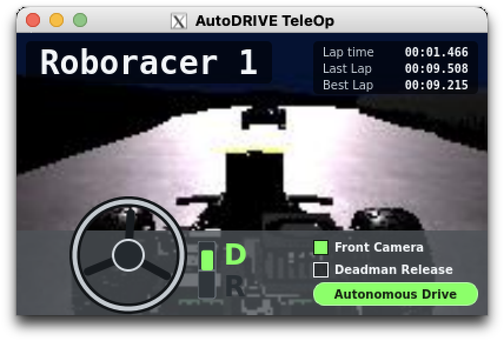

# AutoDRIVE Teleop




`autodrive_teleop.py` is a small Qt-based teleoperation dashboard for
AutoDRIVE RoboRacer and F1TENTH-compatible ROS stacks.

It publishes steering and throttle commands from the keyboard, displays basic
race telemetry, can show the front camera feed, and can switch between
Autonomous Drive and Manual Drive mode. Manual Drive mode publishes native
AutoDRIVE command topics by default, with optional F1TENTH-compatible
`sensor_msgs/Joy` output.

## Features

- Qt Widgets dashboard with keyboard control.
- ROS 1 and ROS 2 support from the same script.
- Native AutoDRIVE command output:
  - `<namespace>/throttle_command`
  - `<namespace>/steering_command`
  - `/autodrive/reset_command`
- Autonomous Drive and Manual Drive modes with native AutoDRIVE command output.
- Optional F1TENTH-compatible `sensor_msgs/Joy` output.
- Optional front camera preview from `sensor_msgs/Image`.
- Optional lap time, last lap, best lap, speed, and collision count display.
- Configurable vehicle namespace and telemetry topics.
- Smooth throttle and steering ramping.

## Requirements

You need Python 3, one supported Qt binding, and either ROS 1 or ROS 2 Python
packages available in your shell.

Supported Qt bindings:

- `PyQt5`
- `PySide6`
- `PySide2`

ROS message dependencies:

- `sensor_msgs`
- `std_msgs`

For ROS 1, the script imports `rospy`.

For ROS 2, the script imports `rclpy`.

## Installation

Clone the repository:

```bash
git clone <your-repo-url> autodrive_teleop
cd autodrive_teleop
```

Install a Qt binding if your environment does not already provide one:

```bash
python3 -m pip install PyQt5
```

Make the script executable:

```bash
chmod +x autodrive_teleop.py
```

Source your ROS environment before running the tool.

ROS 2 example:

```bash
source /opt/ros/humble/setup.bash
./autodrive_teleop.py --ros 2
```

ROS 1 example:

```bash
source /opt/ros/noetic/setup.bash
./autodrive_teleop.py --ros 1
```

## Basic Usage

Start AutoDRIVE RoboRacer simulator and bridge first, then run:

```bash
./autodrive_teleop.py
```

By default, the script targets ROS 2 and the vehicle namespace:

```text
/autodrive/roboracer_1
```

The default AutoDRIVE command topics are:

```text
/autodrive/roboracer_1/throttle_command
/autodrive/roboracer_1/steering_command
/autodrive/reset_command
```

Use a different vehicle namespace with `--namespace`:

```bash
./autodrive_teleop.py --ros 2 --namespace /autodrive/roboracer_sagolyuksu
```

The AutoDRIVE bridge or simulator must subscribe to the same command topics. If
your bridge is hard-coded to `/autodrive/roboracer_1`, update the bridge config
or use ROS remapping.

## Window Settings

The dashboard stores window geometry and UI state in `.autodrive_teleop.ini`
next to the script by default. Set `AUTODRIVE_TELEOP_SETTINGS` to write the
settings file somewhere else, such as a host-mounted path when running in a
throwaway container.

## Controls

Click the teleop window first so it has keyboard focus.

| Key | Action |
| --- | --- |
| Up arrow | Forward throttle |
| Down arrow | Reverse throttle |
| Left arrow | Steer left |
| Right arrow | Steer right |
| Space | Stop throttle and steering |
| R | Stop and publish AutoDRIVE reset command |
| A | Toggle Autonomous Drive/Manual Drive output mode |
| Escape | Quit |

Throttle and steering return toward zero when the arrow keys are released.

## Autonomous Drive Mode

Autonomous Drive mode publishes only the drive-state extension topic:

```text
/autodrive/deadman_switch = true
```

It does not publish teleoperation throttle or steering commands in this mode.
This prevents AutoDRIVE Teleop from mixing zero-valued commands with an
autonomous driving stack that owns the native AutoDRIVE command topics.

Example:

```bash
./autodrive_teleop.py \
  --ros 2 \
  --mode autonomous \
  --namespace /autodrive/roboracer_1
```

## AutoDRIVE Teleop's Extension Topics

`autodrive_teleop.py` publishes an additional `std_msgs/Bool` drive-state topic:

```text
/autodrive/deadman_switch
```

The value indicates which side currently has control:

| Value | Meaning |
| --- | --- |
| `true` / `1` | Autonomous Drive mode |
| `false` / `0` | Manual Drive mode |

This is an AutoDRIVE Teleop extension topic for autonomous driving software
built on the AutoDRIVE Devkit. A controller can subscribe to
`/autodrive/deadman_switch` and publish to
`/autodrive/roboracer_1/throttle_command` and
`/autodrive/roboracer_1/steering_command` only while the value is `true`.
When the value is `false`, AutoDRIVE Teleop is in Manual Drive mode and owns the
teleoperation command output.

## Manual Drive Mode

Manual Drive mode changes `/autodrive/deadman_switch` to `false` and publishes
the teleoperation command output. By default, it uses the native AutoDRIVE
command topics:

```text
<namespace>/throttle_command
<namespace>/steering_command
```

Use `--f1tenth` only when you want F1TENTH-compatible `sensor_msgs/Joy` output
instead of AutoDRIVE command messages.

Output topic:

- ROS 1: `/vesc/joy`
- ROS 2: `/joy`

Joy output mapping:

| Joy field | Value |
| --- | --- |
| `axes[1]` | throttle |
| `axes[3]` | steering |
| `buttons[4]` | `1` |
| `buttons[5]` | `0` |

Display control input is read from F1TENTH Ackermann command topics:

- ROS 1: `/vesc/low_level/ackermann_cmd_mux/output`
- ROS 2: `/drive`
- Message type: `ackermann_msgs/AckermannDriveStamped`

Start directly in Manual Drive mode:

```bash
./autodrive_teleop.py --ros 2 --mode manual
```

Or force F1TENTH-only publishing:

```bash
./autodrive_teleop.py --ros 2 --f1tenth
```

`--f1tenth` prevents native AutoDRIVE command publishing in Manual Drive mode.
This is useful when you only want Joy output for a F1TENTH stack.

## Telemetry Topics

If not specified, telemetry topics are resolved from `--namespace`.

| Option | Default |
| --- | --- |
| `--camera-topic` | `<namespace>/front_camera` |
| `--speed-topic` | `<namespace>/speed` |
| `--lap-time-topic` | `<namespace>/lap_time` |
| `--last-lap-topic` | `<namespace>/last_lap_time` |
| `--best-lap-topic` | `<namespace>/best_lap_time` |
| `--collision-count-topic` | `<namespace>/collision_count` |

Example with custom telemetry:

```bash
./autodrive_teleop.py \
  --ros 2 \
  --namespace /autodrive/roboracer_1 \
  --camera-topic /camera/image_raw \
  --speed-topic /vehicle/speed
```

The camera panel supports common image encodings such as `rgb8`, `bgr8`,
`rgba8`, `bgra8`, and `mono8`.

## Command Rate And Ramping

The command publish rate defaults to 20 Hz:

```bash
./autodrive_teleop.py --rate 30
```

Native AutoDRIVE command output applies a throttle scale so the direct
`Float32` command path is less aggressive by default:

```bash
./autodrive_teleop.py --autodrive-throttle-scale 0.35
```

You can also adjust the native steering scale:

```bash
./autodrive_teleop.py --autodrive-steering-scale 0.8
```

Throttle and steering ramp speed can be adjusted:

```bash
./autodrive_teleop.py --throttle-step 1.0 --steer-step 1.8
```

Ramp values are in normalized command units per second. Keyboard input is
clamped to the range `[-1.0, 1.0]`, then native AutoDRIVE scale factors are
applied before publishing.

## Useful Examples

ROS 2 AutoDRIVE RoboRacer:

```bash
./autodrive_teleop.py --ros 2 --namespace /autodrive/roboracer_1
```

ROS 1 AutoDRIVE bridge:

```bash
./autodrive_teleop.py --ros 1 --namespace /autodrive/roboracer_1
```

ROS 2 F1TENTH-compatible Joy output:

```bash
./autodrive_teleop.py --ros 2 --mode manual --f1tenth
```

ROS 1 F1TENTH-compatible VESC Joy output:

```bash
./autodrive_teleop.py --ros 1 --mode manual --f1tenth
```

Custom RoboRacer namespace:

```bash
./autodrive_teleop.py --ros 2 --namespace /autodrive/roboracer_sagolyuksu
```

## Troubleshooting

If the window opens but the vehicle does not move, check the command topics:

```bash
ros2 topic list
ros2 topic echo /autodrive/roboracer_1/throttle_command
```

or for ROS 1:

```bash
rostopic list
rostopic echo /autodrive/roboracer_1/throttle_command
```

If Qt is missing, install one supported binding:

```bash
python3 -m pip install PyQt5
```

If ROS imports fail, make sure the correct ROS setup file is sourced in the same
terminal where you run the script.

If the keyboard does not control the car, click the teleop window once to give
it focus.
